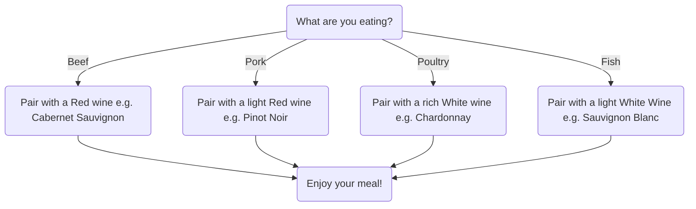

# Wine Pairing Diagram

### Diagram Description

#### Overview
This flowchart provides wine pairing recommendations based on different types of basic foods. It guides users through selecting an appropriate wine varietal to complement their meal.

#### Entities

- **"What are you eating?"**: Beginning of the meal decision in order to recommend a wine varietal.
- **Beef**: Dishes like steak or burgers are best paired with bold red wines.
- **Pork**: Dishes like pork chops go well with light red wines.
- **Poultry**: Dishes like roasted turkey or chicken pair nicely with rich white wines.
- **Fish**: Seafood dishes pair well with light white wines.
- **"Enjoy Your Meal!"**: The final step where the user enjoys their food and wine pairing.

#### Use Case   
This flowchart diagram serves as a quick reference for individuals seeking to enhance their dining experience through appropriate wine selections. 